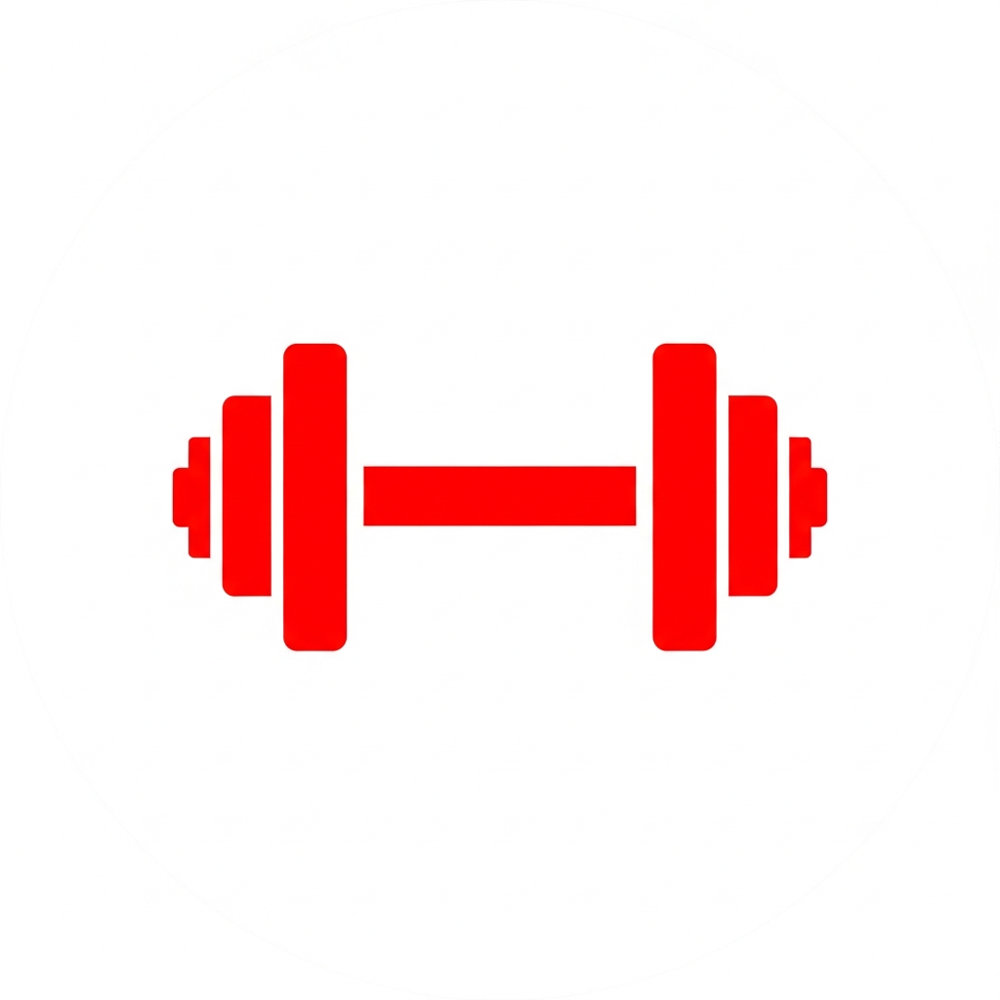
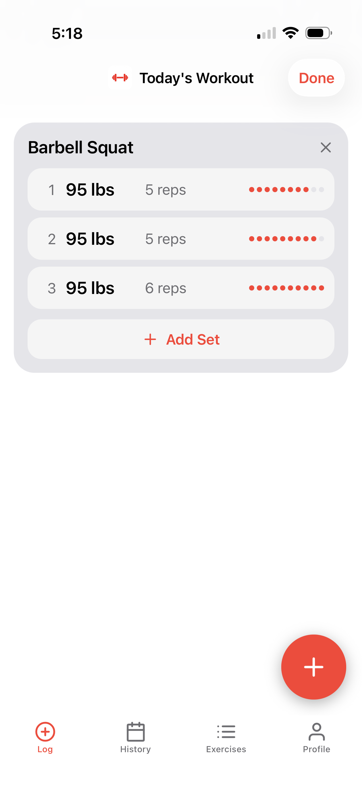
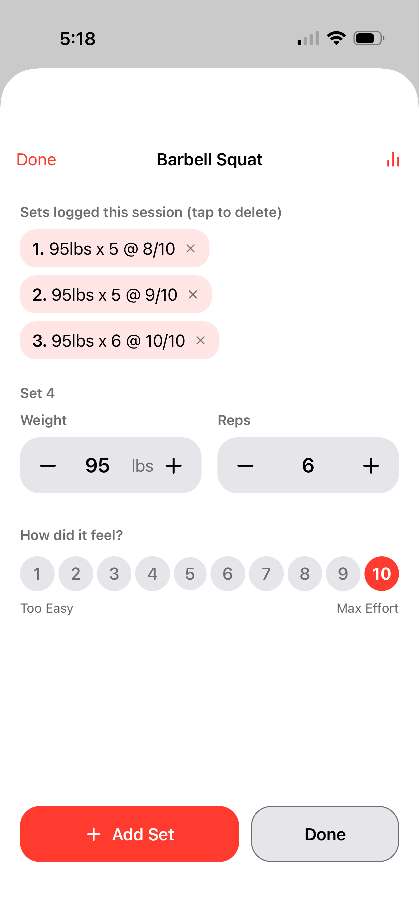
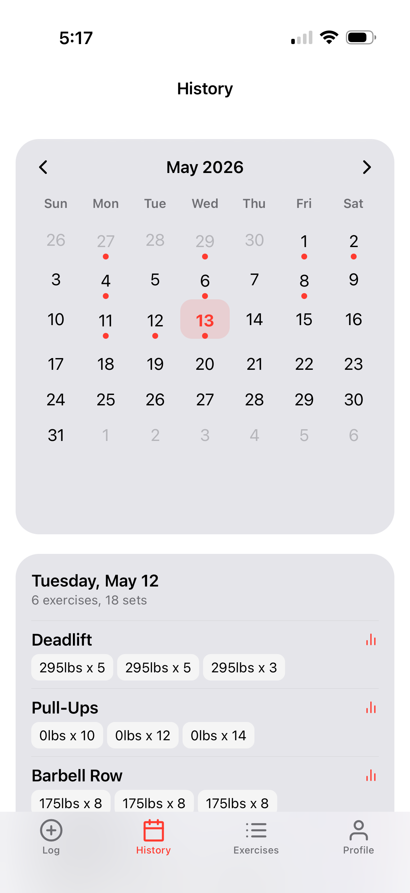
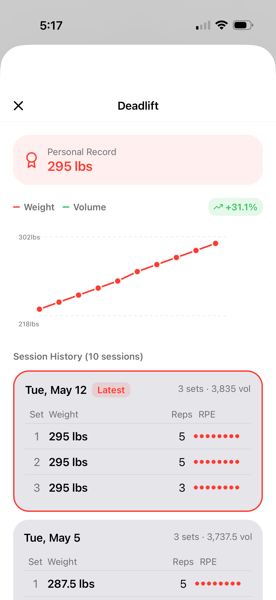
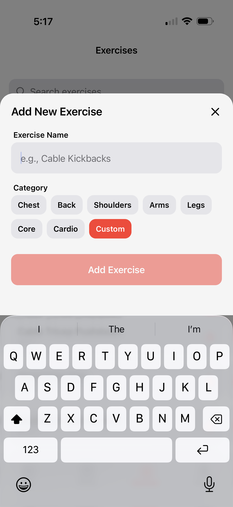

<p align="center">
  
</p>

<h1 align="center">IronLog</h1>

<p align="center">
  Fine-grained tracking built for progressive overload. Every set logged with weight, reps, and RPE so the trends that drive your next session are always one tap away. Designed for the gym floor: big touch targets, haptic feedback, and one-handed operation so you can log between rests without breaking flow.
</p>

## Screenshots

<p align="center">
  
  
  
  
  
</p>

## Getting started

Requires Node 22 and `pnpm`. See [`docs/local-development.md`](docs/local-development.md) for full setup.

```bash
pnpm install
docker-compose up -d db        # start PostgreSQL
pnpm db:push                   # apply schema
pnpm db:seed                   # built-in exercises
pnpm server:dev                # API on :5000
pnpm expo:dev                  # Expo dev server
```

## Project layout

```
client/   React Native app
server/   Express API
shared/   Drizzle tables + Zod schemas
scripts/  Database seeds + tooling
```

See [`CLAUDE.md`](CLAUDE.md) for architecture notes and conventions.
