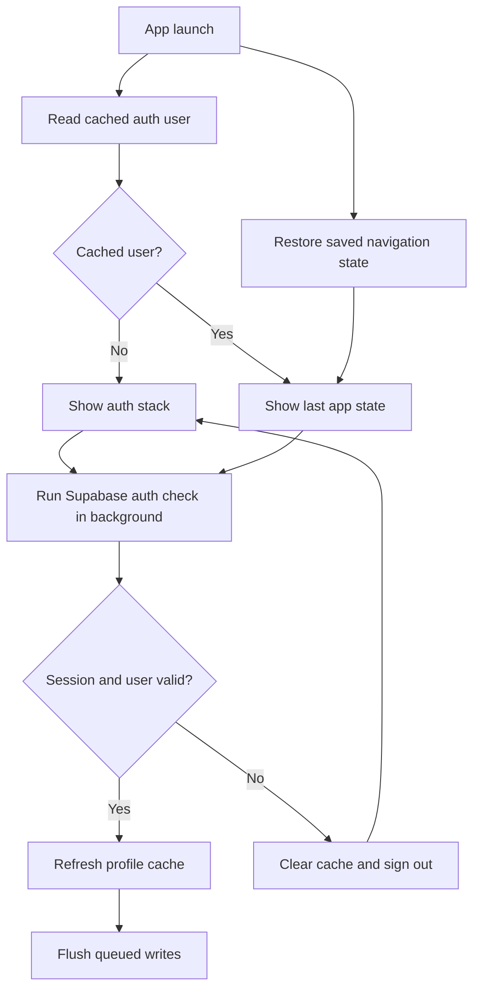

# Auth Launch

IronLog starts from local state first. Network auth validation is authoritative,
but it no longer blocks the first usable screen.

## Guarantees

- No loading screen is shown between local auth hydration and network validation.
- Cached auth stores only profile display fields, not Supabase tokens.
- A failed background auth check clears the cached user and returns to auth.

## Launch Flow

## Code Map

- `client/App.tsx` restores navigation state after confirming a cached user.
- `client/contexts/AuthContext.tsx` hydrates the cached user, then validates
  Supabase auth in the background.
- `client/navigation/RootStackNavigator.tsx` chooses the app or auth stack from
  the hydrated local decision.
- `client/lib/auth-cache-core.ts` owns cache parsing and startup route decisions.
